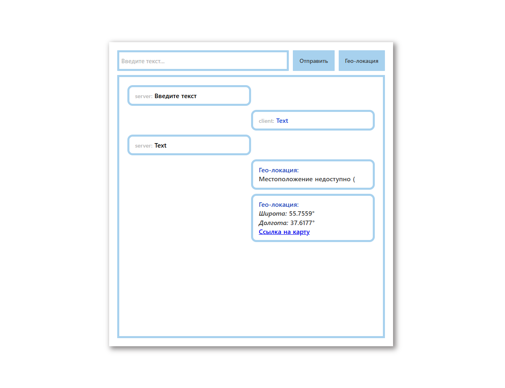

# Server_chat

 

### Landing page with:
:heavy_check_mark: HTML  
:heavy_check_mark: CSS  
:heavy_check_mark: JS  
:heavy_check_mark: Responsive-Design 

### Without:
:x: Preprocessors 
:x: Libraries 
:x: Frameworks 
:x: Pixel-Perfect

#### Original layout: :x:
